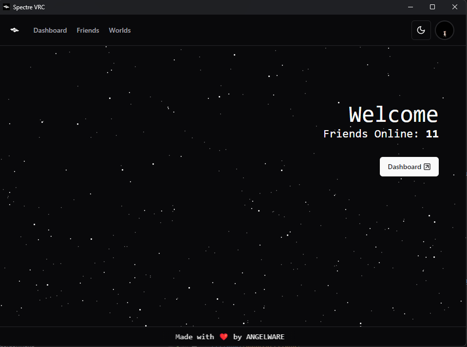
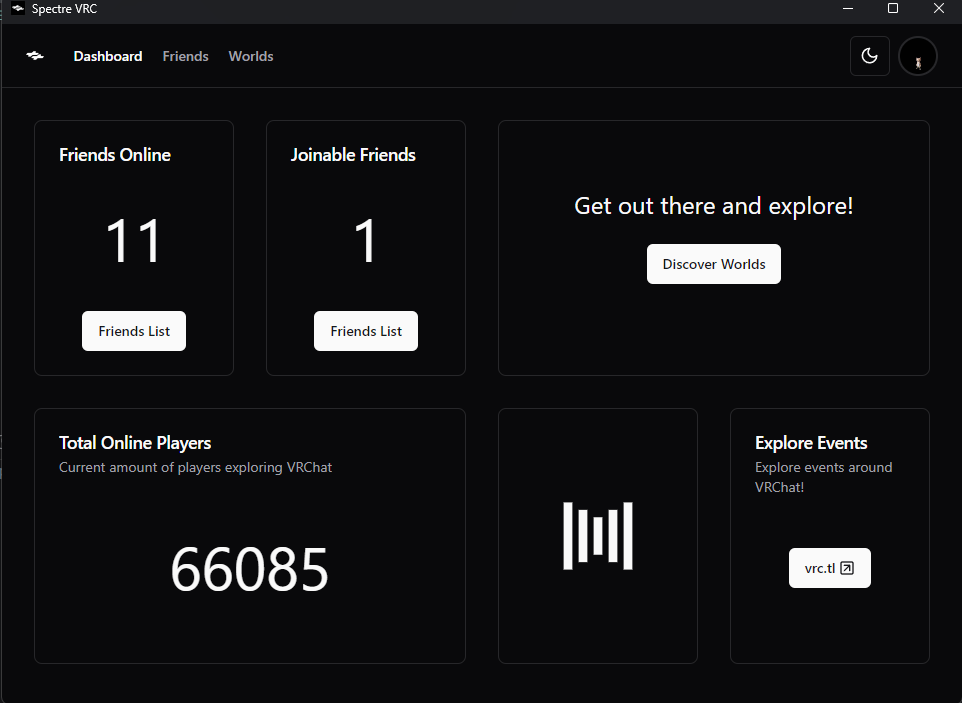
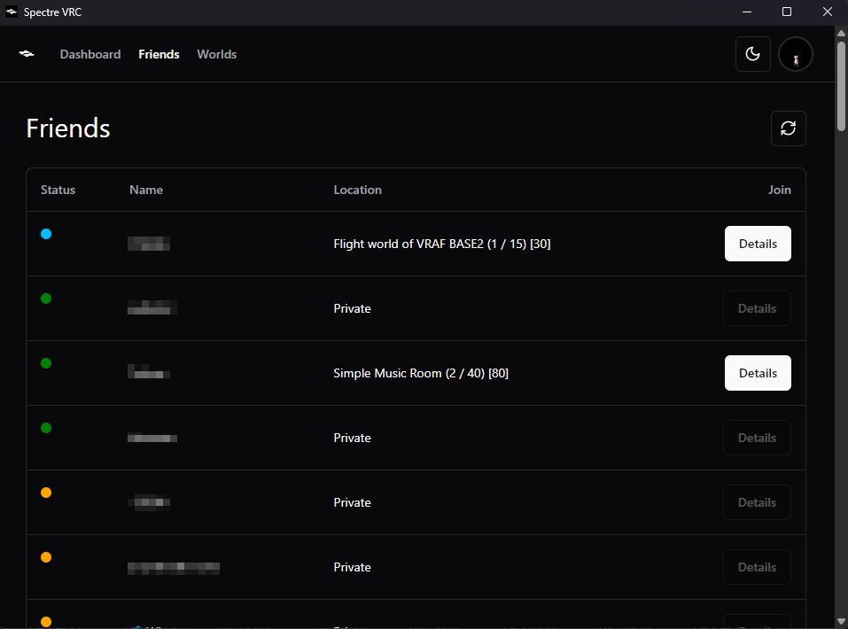

# Spectre

A friends list manager for VRChat. Built on Sveltekit + Tauri. Thanks to Tauri, Spectre is cross-platform by default, with mobile support planned for the (very) near future.

## Warnings

This project is largely under development, things may be broken or imperfect! 

> [!CAUTION]
> VRC's official stance on using their API is to use it non-maliciously, Spectre performs no malicious functions, but makes a large number of API calls. I am not responsible for your account getting rate-limited or locked.

## Philosophy

The goal of Spectre is to provide a minimal, fast, and easy way to view your VRC friends list without opening the website. It is meant to only give you the information you want to see, without logging tons of information you do not need to see, such as avatar changes, or constant location updates. Spectre only includes the features you need and not the ones you don't.

## Building

For development:

```shell
npm run tauri dev
```

For production:

```shell
npm run tauri build
```

## Current Features

- Dashboard: Get a quick overview of your friends online and the current VRChat player count.
- Friends List: See who's online and their status.
- Instances: See active instances and which friends are in them.
- Notifications: Get system-level notifications for invites, requests, friend requests, and more.
- XSOverlay Integration: Get real-time notifications in your headset.

## Credits

- [Community-driven VRCAPI Docs](https://vrchatapi.github.io/docs/api/)

## Screenshots




